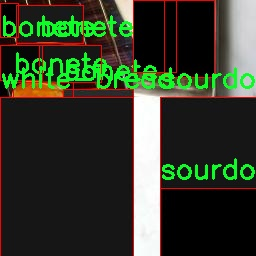

### 1.背景意义

### 研究背景与意义

随着计算机视觉技术的迅猛发展，深度学习在图像识别领域的应用日益广泛，尤其是在食品识别方面。面包作为全球范围内普遍消费的食品，其种类繁多且各具特色，如何准确识别不同种类的面包不仅具有重要的商业价值，也对食品安全、营养分析和消费者教育等方面具有深远的影响。传统的面包识别方法往往依赖于人工分类和经验判断，效率低下且容易出现误差。因此，基于深度学习的自动化识别系统应运而生，成为提升面包种类识别准确性和效率的有效途径。

本研究旨在基于改进的YOLOv11模型，构建一个高效的面包种类识别系统。该系统将利用一个包含4672张图像的多样化数据集，涵盖15种不同类型的面包，包括法棍、牛角包、玉米面包等。这些面包种类的多样性为模型的训练提供了丰富的样本，能够有效提升识别的鲁棒性和准确性。数据集经过精心的预处理和增强，确保了训练过程中模型能够适应不同的光照、角度和背景变化，从而提升其在实际应用中的表现。

通过引入YOLOv11这一先进的目标检测算法，本研究不仅希望在识别精度上取得突破，更期望能够在实时性和计算效率上实现优化。这一系统的成功实施，将为面包行业的自动化检测、智能零售和消费者服务提供强有力的技术支持，同时也为相关领域的研究提供新的思路和方法。最终，本研究将推动计算机视觉技术在食品识别领域的应用，为实现更智能化的食品管理和服务奠定基础。

### 2.视频效果

[2.1 视频效果](https://www.bilibili.com/video/BV1yPUdYtEAb/)

### 3.图片效果


##### [项目涉及的源码数据来源链接](https://kdocs.cn/l/cszuIiCKVNis)**

注意：本项目提供训练的数据集和训练教程,由于版本持续更新,暂不提供权重文件（best.pt）,请按照6.训练教程进行训练后实现上图演示的效果。

### 4.数据集信息

##### 4.1 本项目数据集类别数＆类别名

nc: 15
names: ['baguette', 'binangkal', 'bonete', 'cornbread', 'croissant', 'ensaymada', 'flatbread', 'kalihim', 'monay', 'pandesal', 'sourdough', 'spanish-bread', 'wheat-bread', 'white-bread', 'whole-grain-bread']


该项目为【目标检测】数据集，请在【训练教程和Web端加载模型教程（第三步）】这一步的时候按照【目标检测】部分的教程来训练

##### 4.2 本项目数据集信息介绍

本项目数据集信息介绍

本项目旨在通过改进YOLOv11算法，构建一个高效的面包种类识别系统，以实现对多种面包的自动分类与识别。为此，我们构建了一个丰富且多样化的数据集，专注于“Bread Detector”主题。该数据集包含15个不同的面包类别，涵盖了从传统到现代的多种面包类型，确保了模型在实际应用中的广泛适用性和准确性。

数据集中包含的面包类别包括：法棍（baguette）、比南卡尔（binangkal）、波内特（bonete）、玉米面包（cornbread）、可颂（croissant）、恩赛马达（ensaymada）、扁面包（flatbread）、卡利希姆（kalihim）、莫纳伊（monay）、潘德萨尔（pandesal）、酸面包（sourdough）、西班牙面包（spanish-bread）、小麦面包（wheat-bread）、白面包（white-bread）以及全谷物面包（whole-grain-bread）。这些类别的选择不仅反映了不同地区的面包文化，也展示了面包制作的多样性和丰富性。

为了确保数据集的质量和有效性，我们在数据收集过程中采用了多种来源，包括面包店、超市和家庭制作的面包，确保每种面包的图像在不同的光照、角度和背景下都有所涵盖。此外，数据集中的每个图像都经过精确标注，确保训练模型时能够准确识别各类面包的特征。这种细致的标注工作为后续的模型训练提供了坚实的基础，能够有效提升YOLOv11在面包种类识别任务中的性能。

总之，本项目的数据集不仅丰富多样，而且经过精心设计和标注，旨在为面包种类识别系统的训练提供强有力的支持，助力于实现更高效的自动化识别和分类。





### 5.全套项目环境部署视频教程（零基础手把手教学）

[5.1 所需软件PyCharm和Anaconda安装教程（第一步）](https://www.bilibili.com/video/BV1BoC1YCEKi/?spm_id_from=333.999.0.0&vd_source=bc9aec86d164b67a7004b996143742dc)


[5.2 安装Python虚拟环境创建和依赖库安装视频教程（第二步）](https://www.bilibili.com/video/BV1ZoC1YCEBw?spm_id_from=333.788.videopod.sections&vd_source=bc9aec86d164b67a7004b996143742dc)

### 6.改进YOLOv11训练教程和Web_UI前端加载模型教程（零基础手把手教学）

[6.1 改进YOLOv11训练教程和Web_UI前端加载模型教程（第三步）](https://www.bilibili.com/video/BV1BoC1YCEhR?spm_id_from=333.788.videopod.sections&vd_source=bc9aec86d164b67a7004b996143742dc)


按照上面的训练视频教程链接加载项目提供的数据集，运行train.py即可开始训练



     Epoch   gpu_mem       box       obj       cls    labels  img_size
     1/200     20.8G   0.01576   0.01955  0.007536        22      1280: 100%|██████████| 849/849 [14:42<00:00,  1.04s/it]
               Class     Images     Labels          P          R     mAP@.5 mAP@.5:.95: 100%|██████████| 213/213 [01:14<00:00,  2.87it/s]
                 all       3395      17314      0.994      0.957      0.0957      0.0843

     Epoch   gpu_mem       box       obj       cls    labels  img_size
     2/200     20.8G   0.01578   0.01923  0.007006        22      1280: 100%|██████████| 849/849 [14:44<00:00,  1.04s/it]
               Class     Images     Labels          P          R     mAP@.5 mAP@.5:.95: 100%|██████████| 213/213 [01:12<00:00,  2.95it/s]
                 all       3395      17314      0.996      0.956      0.0957      0.0845

     Epoch   gpu_mem       box       obj       cls    labels  img_size
     3/200     20.8G   0.01561    0.0191  0.006895        27      1280: 100%|██████████| 849/849 [10:56<00:00,  1.29it/s]
               Class     Images     Labels          P          R     mAP@.5 mAP@.5:.95: 100%|███████   | 187/213 [00:52<00:00,  4.04it/s]
                 all       3395      17314      0.996      0.957      0.0957      0.0845


###### [项目数据集下载链接](https://kdocs.cn/l/cszuIiCKVNis)

### 7.原始YOLOv11算法讲解


##### YOLO11介绍

Ultralytics YOLO11是一款尖端的、最先进的模型，它在之前YOLO版本成功的基础上进行了构建，并引入了新功能和改进，以进一步提升性能和灵活性。
**YOLO11设计快速、准确且易于使用，使其成为各种物体检测和跟踪、实例分割、图像分类以及姿态估计任务的绝佳选择。**


**结构图如下：**


##### **C3k2**

**C3k2，结构图如下**


**C3k2，继承自类`C2f，其中通过c3k设置False或者Ture来决定选择使用C3k还是`**Bottleneck


**实现代码** **ultralytics/nn/modules/block.py**

##### C2PSA介绍

**借鉴V10 PSA结构，实现了C2PSA和C2fPSA，最终选择了基于C2的C2PSA（可能涨点更好？）**


**实现代码** **ultralytics/nn/modules/block.py**

##### Detect介绍

**分类检测头引入了DWConv（更加轻量级，为后续二次创新提供了改进点），结构图如下（和V8的区别）：**


### 8.200+种全套改进YOLOV11创新点原理讲解

#### 8.1 200+种全套改进YOLOV11创新点原理讲解大全

由于篇幅限制，每个创新点的具体原理讲解就不全部展开，具体见下列网址中的改进模块对应项目的技术原理博客网址【Blog】（创新点均为模块化搭建，原理适配YOLOv5~YOLOv11等各种版本）

[改进模块技术原理博客【Blog】网址链接](https://gitee.com/qunmasj/good)


#### 8.2 精选部分改进YOLOV11创新点原理讲解

###### 这里节选部分改进创新点展开原理讲解(完整的改进原理见上图和[改进模块技术原理博客链接](https://gitee.com/qunmasj/good)【如果此小节的图加载失败可以通过CSDN或者Github搜索该博客的标题访问原始博客，原始博客图片显示正常】


### Context_Grided_Network(CGNet)简介
参考该博客提出的一种轻量化语义分割模型Context Grided Network(CGNet)，以满足设备的运行需要。

CGNet主要由CG块构建而成，CG块可以学习局部特征和周围环境上下文的联合特征，最后通过引入全局上下文特征进一步改善联合特征的学习。


 
下图给出了在Cityscapes数据集上对现有的一些语义分割模型的测试效果，横轴表示参数量，纵轴表示准确率(mIoU)。可以看出，在参数量较少的情况下，CGNet可以达到一个比较好的准确率。虽与高精度模型相去甚远，但在一些对精度要求不高、对实时性要求比较苛刻的情况下，很有价值。


高精度模型，如DeepLab、DFN、DenseASPP等，动不动就是几十M的参数，很难应用在移动设备上。而上图中红色的模型，相对内存占用较小，但它们的分割精度却不是很高。作者认为主要原因是，这些小网络大多遵循着分类网络的设计思路，并没有考虑语义分割任务更深层次的特点。

空间依赖性和上下文信息对提高分割精度有很大的作用。作者从该角度出发，提出了CG block，并进一步搭建了轻量级语义分割网络CGNet。CG块具有以下特点： 

学习局部特征和上下文特征的联合特征；
通过全局上下文特征改进上述联合特征；
可以贯穿应用在整个网络中，从low level（空间级别）到high level（语义级别）。不像PSPNet、DFN、DenseASPP等，只在编码阶段以后捕捉上下文特征。；
只有3个下采样，相比一般5个下采样的网络，能够更好地保留边缘信息。
CGNet遵循“深而薄”的原则设计，整个网络又51层构成。其中，为了降低计算，大量使用了channel-wise conv.

小型语义分割模型：

需要平衡准确率和系统开销
进化路线：ENet -> ICNet -> ESPNet
这些模型基本都基于分类网络设计，在分割准确率上效果并不是很好
上下文信息模型：

大多数现有模型只考虑解码阶段的上下文信息并且没有利用周围的上下文信息
注意力机制：

CG block使用全局上下文信息计算权重向量，并使用其细化局部特征和周围上下文特征的联合特征

#### Context Guided Block
CG block由4部分组成：


此外，CG block还采用了残差学习。文中提出了局部残差学习（LRL）和全局残差学习（GRL）两种方式。 LRL添加了从输入到联合特征提取器的连接，GRL添加了从输入到全局特征提取器的连接。从直观上来说，GRL比LRL更能促进网络中的信息传递（更像ResNet~~），后面实验部分也进行了测试，的确GRL更能提升分割精度。


CGNet的通用网络结构如下图所示，分为3个stage，第一个stage使用3个卷积层抽取特征，第二和第三个stage堆叠一定数量的CG block，具体个数可以根据情况调整。最后，通过1x1 conv得到分割结果。


下图是用于Cityscapes数据集的CGNet网络细节说明：输入尺寸为3*680*680；stage1连续使用了3个Conv-BN-PReLU组合，首个组合使用了stride=2的卷积，所以得到了1/2分辨率的feature map；stage2和stage3分别使用了多个CG block，且其中使用了不同大小的膨胀卷积核，最终分别得到了1/4和1/8的feature map。

需注意：

stage2&3的输入特征分别由其上一个stage的首个和最后一个block组合给出（参考上图的绿色箭头）；

输入注入机制，图中未体现，实际使用中，作者还将输入图像下采样1/4或1/8，分别给到stage2和stage3的输入中 ，以进一步加强特征传递。

channel-wise conv。为了缩减参数数量，在局部特征提取器和周围上下文特征提取器中使用了channel-wise卷积，可以消除跨通道的计算成本，同时节省内存占用。但是，没有像MobileNet等模型一样，在depth-wise卷积后面接point-wise卷积（1*1 conv），作者解释是，因为CG block需要保持局部特征和周围上下文特征的独立性，而1*1 conv会破坏这种独立性，所以效果欠佳，实验部分也进行了验证。

个人感觉此处应该指的是depth-wise卷积？

官方Git中对该部分的实现如下：


### 9.系统功能展示

图9.1.系统支持检测结果表格显示

  图9.2.系统支持置信度和IOU阈值手动调节

  图9.3.系统支持自定义加载权重文件best.pt(需要你通过步骤5中训练获得)

  图9.4.系统支持摄像头实时识别

  图9.5.系统支持图片识别

  图9.6.系统支持视频识别

  图9.7.系统支持识别结果文件自动保存

  图9.8.系统支持Excel导出检测结果数据


### 10. YOLOv11核心改进源码讲解

#### 10.1 UniRepLKNet.py

以下是对给定代码的核心部分进行分析和详细注释的结果。为了简化代码，保留了最重要的类和函数，同时提供了中文注释。

```python
import torch
import torch.nn as nn
import torch.nn.functional as F
from timm.layers import trunc_normal_, DropPath, to_2tuple

class GRNwithNHWC(nn.Module):
    """ 
    GRN (Global Response Normalization) 层
    该层对输入进行全局响应归一化，假设输入格式为 (N, H, W, C)
    """
    def __init__(self, dim, use_bias=True):
        super().__init__()
        self.use_bias = use_bias
        self.gamma = nn.Parameter(torch.zeros(1, 1, 1, dim))  # 可学习参数
        if self.use_bias:
            self.beta = nn.Parameter(torch.zeros(1, 1, 1, dim))  # 可学习偏置

    def forward(self, x):
        Gx = torch.norm(x, p=2, dim=(1, 2), keepdim=True)  # 计算L2范数
        Nx = Gx / (Gx.mean(dim=-1, keepdim=True) + 1e-6)  # 归一化
        if self.use_bias:
            return (self.gamma * Nx + 1) * x + self.beta  # 应用归一化和偏置
        else:
            return (self.gamma * Nx + 1) * x

class DilatedReparamBlock(nn.Module):
    """
    Dilated Reparam Block
    该模块用于实现膨胀卷积的重参数化，假设输入格式为 (N, C, H, W)
    """
    def __init__(self, channels, kernel_size, deploy, use_sync_bn=False):
        super().__init__()
        self.lk_origin = nn.Conv2d(channels, channels, kernel_size=kernel_size, stride=1,
                                    padding=kernel_size//2, dilation=1, groups=channels, bias=True)
        self.use_sync_bn = use_sync_bn
        self.origin_bn = nn.BatchNorm2d(channels) if not deploy else nn.Identity()

    def forward(self, x):
        out = self.origin_bn(self.lk_origin(x))  # 应用卷积和批归一化
        return out

class UniRepLKNetBlock(nn.Module):
    """
    UniRepLKNet中的基本块
    该块包含了卷积、归一化、激活等操作
    """
    def __init__(self, dim, kernel_size, drop_path=0., deploy=False):
        super().__init__()
        self.dwconv = DilatedReparamBlock(dim, kernel_size, deploy=deploy)  # 膨胀卷积
        self.norm = nn.BatchNorm2d(dim) if not deploy else nn.Identity()  # 归一化
        self.se = nn.Sequential(nn.Conv2d(dim, dim // 4, kernel_size=1), nn.ReLU(), 
                                nn.Conv2d(dim // 4, dim, kernel_size=1), nn.Sigmoid())  # Squeeze-and-Excitation模块

    def forward(self, inputs):
        x = self.dwconv(inputs)  # 通过膨胀卷积
        x = self.norm(x)  # 归一化
        x = x * self.se(x)  # 应用Squeeze-and-Excitation
        return x

class UniRepLKNet(nn.Module):
    """
    UniRepLKNet模型
    包含多个UniRepLKNetBlock
    """
    def __init__(self, in_chans=3, num_classes=1000, depths=(3, 3, 27, 3), dims=(96, 192, 384, 768)):
        super().__init__()
        self.stages = nn.ModuleList()
        for i in range(len(depths)):
            stage = nn.Sequential(*[UniRepLKNetBlock(dim=dims[i], kernel_size=3) for _ in range(depths[i])])
            self.stages.append(stage)

    def forward(self, x):
        for stage in self.stages:
            x = stage(x)  # 通过每个阶段
        return x

def unireplknet_a(weights='', **kwargs):
    """ 创建UniRepLKNet模型的实例 """
    model = UniRepLKNet(depths=(2, 2, 6, 2), dims=(40, 80, 160, 320), **kwargs)
    if weights:
        model.load_state_dict(torch.load(weights))  # 加载权重
    return model

if __name__ == '__main__':
    inputs = torch.randn((1, 3, 640, 640))  # 随机输入
    model = unireplknet_a()  # 创建模型
    res = model(inputs)  # 前向传播
    print(res.shape)  # 输出结果形状
```

### 代码分析
1. **GRNwithNHWC**: 实现了全局响应归一化的层，适用于图像处理。
2. **DilatedReparamBlock**: 实现了膨胀卷积的重参数化，提升了模型的表达能力。
3. **UniRepLKNetBlock**: 该模块组合了卷积、归一化和Squeeze-and-Excitation模块，增强了特征提取能力。
4. **UniRepLKNet**: 该类构建了整个网络结构，包含多个UniRepLKNetBlock，负责输入的前向传播。
5. **unireplknet_a**: 用于创建模型实例并加载预训练权重。

以上是对代码的核心部分和功能的详细分析和注释。

该文件实现了一个名为UniRepLKNet的深度学习模型，主要用于音频、视频、点云、时间序列和图像识别。模型的设计灵感来源于多个现有的网络架构，包括RepLKNet、ConvNeXt、DINO和DeiT等。文件中包含了多个类和函数，下面对其进行逐一分析。

首先，文件引入了必要的库，包括PyTorch及其子模块，定义了一些基本的操作和层。接着，定义了多个类，如GRNwithNHWC、NCHWtoNHWC和NHWCtoNCHW，这些类主要用于实现特定的层或转换功能。例如，GRNwithNHWC类实现了全局响应归一化层，NCHWtoNHWC和NHWCtoNCHW类则用于在不同的通道格式之间进行转换。

接下来，文件中定义了一个get_conv2d函数，该函数用于根据输入参数决定使用哪种卷积实现，支持原生卷积和高效的iGEMM卷积实现。这个函数的设计考虑了卷积的各种参数，如输入输出通道、卷积核大小、步幅、填充等。

SEBlock类实现了Squeeze-and-Excitation模块，这是一种用于增强网络特征表示能力的机制。该模块通过自适应平均池化和全连接层来调整特征通道的权重。

fuse_bn函数用于将卷积层和批归一化层融合，以减少推理时的计算量。convert_dilated_to_nondilated和merge_dilated_into_large_kernel函数则用于处理膨胀卷积和合并卷积核。

DilatedReparamBlock类实现了膨胀重参数化块，主要用于处理具有不同膨胀率的卷积操作。该类根据给定的卷积核大小和膨胀率，动态生成多个卷积层，并在前向传播时进行计算。

UniRepLKNetBlock类是UniRepLKNet的基本构建块，结合了深度卷积、归一化、Squeeze-and-Excitation模块和前馈网络。该类支持多种模式，包括部署模式和训练模式。

UniRepLKNet类是整个模型的核心实现，包含了多个阶段的下采样层和UniRepLKNetBlock。构造函数中根据输入参数初始化各个层，并设置相应的超参数。模型的前向传播方法根据输出模式返回特征或分类结果。

LayerNorm类实现了层归一化，支持通道优先和通道后置两种数据格式。该类在前向传播时根据输入格式进行相应的归一化操作。

最后，文件中定义了一些函数（如unireplknet_a、unireplknet_f等），用于创建不同配置的UniRepLKNet模型，并可选择加载预训练权重。主函数部分展示了如何实例化模型并进行前向传播，最后输出模型的结果。

总体而言，该文件实现了一个复杂的深度学习模型，结合了多种现代卷积神经网络的设计理念，具有较强的灵活性和扩展性。

#### 10.2 repvit.py

以下是经过简化和注释的核心代码部分，保留了模型的主要结构和功能：

```python
import torch
import torch.nn as nn
from timm.models.layers import SqueezeExcite

def _make_divisible(v, divisor, min_value=None):
    """
    确保所有层的通道数是8的倍数。
    :param v: 输入的通道数
    :param divisor: 需要被整除的数
    :param min_value: 最小值
    :return: 调整后的通道数
    """
    if min_value is None:
        min_value = divisor
    new_v = max(min_value, int(v + divisor / 2) // divisor * divisor)
    if new_v < 0.9 * v:  # 确保向下取整不超过10%
        new_v += divisor
    return new_v

class Conv2d_BN(nn.Sequential):
    """
    包含卷积层和批归一化层的组合模块。
    """
    def __init__(self, in_channels, out_channels, kernel_size=1, stride=1, padding=0, dilation=1, groups=1):
        super().__init__()
        self.add_module('conv', nn.Conv2d(in_channels, out_channels, kernel_size, stride, padding, dilation, groups, bias=False))
        self.add_module('bn', nn.BatchNorm2d(out_channels))

    @torch.no_grad()
    def fuse_self(self):
        """
        融合卷积层和批归一化层为一个卷积层。
        """
        conv, bn = self._modules.values()
        w = bn.weight / (bn.running_var + bn.eps)**0.5
        w = conv.weight * w[:, None, None, None]
        b = bn.bias + (conv.bias - bn.running_mean) * bn.weight / (bn.running_var + bn.eps)**0.5
        fused_conv = nn.Conv2d(w.size(1), w.size(0), w.shape[2:], stride=conv.stride, padding=conv.padding, dilation=conv.dilation, groups=conv.groups)
        fused_conv.weight.data.copy_(w)
        fused_conv.bias.data.copy_(b)
        return fused_conv

class RepViTBlock(nn.Module):
    """
    RepViT块，包含token混合和通道混合的结构。
    """
    def __init__(self, inp, hidden_dim, oup, kernel_size, stride, use_se, use_hs):
        super(RepViTBlock, self).__init__()
        self.token_mixer = nn.Sequential(
            Conv2d_BN(inp, inp, kernel_size, stride, (kernel_size - 1) // 2, groups=inp),
            SqueezeExcite(inp, 0.25) if use_se else nn.Identity(),
            Conv2d_BN(inp, oup, ks=1, stride=1, pad=0)
        )
        self.channel_mixer = nn.Sequential(
            Conv2d_BN(oup, hidden_dim, 1, 1, 0),
            nn.GELU() if use_hs else nn.Identity(),
            Conv2d_BN(hidden_dim, oup, 1, 1, 0)
        )

    def forward(self, x):
        return self.channel_mixer(self.token_mixer(x))

class RepViT(nn.Module):
    """
    RepViT模型，包含多个RepViT块。
    """
    def __init__(self, cfgs):
        super(RepViT, self).__init__()
        self.features = nn.ModuleList()
        input_channel = cfgs[0][2]
        for k, t, c, use_se, use_hs, s in cfgs:
            output_channel = _make_divisible(c, 8)
            exp_size = _make_divisible(input_channel * t, 8)
            self.features.append(RepViTBlock(input_channel, exp_size, output_channel, k, s, use_se, use_hs))
            input_channel = output_channel

    def forward(self, x):
        for f in self.features:
            x = f(x)
        return x

def repvit_m2_3(weights=''):
    """
    构建RepViT模型的特定配置。
    """
    cfgs = [
        [3, 2, 80, 1, 0, 1],
        [3, 2, 80, 0, 0, 1],
        # ... (省略其他配置)
        [3, 2, 640, 1, 1, 1]
    ]
    model = RepViT(cfgs)
    if weights:
        model.load_state_dict(torch.load(weights)['model'])
    return model

if __name__ == '__main__':
    model = repvit_m2_3('repvit_m2_3_distill_450e.pth')
    inputs = torch.randn((1, 3, 640, 640))
    res = model(inputs)
    for i in res:
        print(i.size())
```

### 代码说明：
1. **_make_divisible**: 确保通道数是8的倍数，以满足模型的设计要求。
2. **Conv2d_BN**: 自定义的卷积层与批归一化层的组合，支持融合操作以提高推理效率。
3. **RepViTBlock**: 代表性ViT块，包含token混合和通道混合的结构。
4. **RepViT**: 主模型类，构建多个RepViT块，形成完整的网络结构。
5. **repvit_m2_3**: 构建特定配置的RepViT模型，并加载预训练权重（如果提供）。

该代码的核心功能是构建和运行一个基于RepViT架构的深度学习模型，适用于图像处理任务。

这个程序文件 `repvit.py` 实现了一个基于 RepVGG 结构的深度学习模型，主要用于图像处理任务。代码中包含了多个类和函数，构建了一个灵活的神经网络架构，并提供了多种模型配置的构造函数。

首先，文件导入了必要的库，包括 PyTorch 的神经网络模块、NumPy 以及用于实现 Squeeze-and-Excitation 模块的 timm 库。`__all__` 列表定义了可以被外部导入的模型名称。

`replace_batchnorm` 函数用于遍历网络的所有子模块，将 BatchNorm2d 替换为 Identity，从而在推理阶段减少计算量。`_make_divisible` 函数确保网络中所有层的通道数都是可被 8 整除的，以满足特定的硬件要求。

`Conv2d_BN` 类是一个组合模块，包含卷积层和 BatchNorm 层，并初始化 BatchNorm 的权重。它还实现了 `fuse_self` 方法，用于将卷积层和 BatchNorm 层融合为一个卷积层，以提高推理速度。

`Residual` 类实现了残差连接，允许输入通过卷积层进行处理并与原始输入相加。它同样实现了 `fuse_self` 方法，用于在推理时优化计算。

`RepVGGDW` 类实现了深度可分离卷积，结合了卷积和 BatchNorm 层，并提供了融合功能。

`RepViTBlock` 类定义了 RepViT 的基本构建块，包含了通道混合和令牌混合的逻辑。它支持使用 Squeeze-and-Excitation 模块和不同的激活函数。

`RepViT` 类是整个模型的核心，构建了多个 RepViTBlock，并实现了前向传播逻辑。它还提供了 `switch_to_deploy` 方法，用于在推理阶段替换 BatchNorm。

`update_weight` 函数用于更新模型的权重，确保新权重与模型结构匹配。

最后，文件中定义了多个函数（如 `repvit_m0_9`, `repvit_m1_0`, 等），用于构建不同配置的 RepViT 模型。这些函数接受权重文件路径作为参数，并在加载权重时调用 `update_weight` 函数。

在 `__main__` 块中，代码实例化了一个 `repvit_m2_3` 模型，并生成了一组随机输入以测试模型的前向传播，最后打印出每个输出的尺寸。

整体来看，这个文件实现了一个高效的图像处理模型，结合了现代深度学习的多种技术，适用于需要高性能和高准确率的视觉任务。

#### 10.3 shiftwise_conv.py

以下是经过简化和注释的核心代码部分：

```python
import math
import torch
import torch.nn as nn
import torch.nn.functional as F

def get_conv2d(in_channels, out_channels, kernel_size, stride, padding, dilation, groups, bias):
    # 创建一个2D卷积层
    return nn.Conv2d(
        in_channels, out_channels, kernel_size, stride, padding, dilation, groups, bias
    )

def get_bn(channels):
    # 创建一个批归一化层
    return nn.BatchNorm2d(channels)

class Mask(nn.Module):
    def __init__(self, size):
        super().__init__()
        # 初始化权重参数，并在[-1, 1]范围内均匀分布
        self.weight = torch.nn.Parameter(data=torch.Tensor(*size), requires_grad=True)
        self.weight.data.uniform_(-1, 1)

    def forward(self, x):
        # 应用sigmoid激活函数并与输入x相乘
        w = torch.sigmoid(self.weight)
        masked_wt = w.mul(x)
        return masked_wt

class ReparamLargeKernelConv(nn.Module):
    def __init__(self, in_channels, out_channels, kernel_size, small_kernel=5, stride=1, groups=1, small_kernel_merged=False, Decom=True, bn=True):
        super(ReparamLargeKernelConv, self).__init__()
        self.kernel_size = kernel_size
        self.small_kernel = small_kernel
        self.Decom = Decom
        padding = kernel_size // 2  # 假设卷积不会改变特征图大小

        if small_kernel_merged:
            # 使用大卷积核的卷积层
            self.lkb_reparam = get_conv2d(
                in_channels=in_channels,
                out_channels=out_channels,
                kernel_size=kernel_size,
                stride=stride,
                padding=padding,
                dilation=1,
                groups=groups,
                bias=True,
            )
        else:
            if self.Decom:
                # 使用小卷积和大卷积的组合
                self.LoRA = conv_bn(
                    in_channels=in_channels,
                    out_channels=out_channels,
                    kernel_size=(kernel_size, small_kernel),
                    stride=stride,
                    padding=padding,
                    groups=groups,
                    bn=bn
                )
            else:
                # 使用单一的大卷积
                self.lkb_origin = conv_bn(
                    in_channels=in_channels,
                    out_channels=out_channels,
                    kernel_size=kernel_size,
                    stride=stride,
                    padding=padding,
                    groups=groups,
                    bn=bn,
                )

            if (small_kernel is not None) and small_kernel < kernel_size:
                # 创建小卷积层
                self.small_conv = conv_bn(
                    in_channels=in_channels,
                    out_channels=out_channels,
                    kernel_size=small_kernel,
                    stride=stride,
                    padding=small_kernel // 2,
                    groups=groups,
                    bn=bn,
                )
        
        self.bn = get_bn(out_channels)  # 批归一化层
        self.act = nn.SiLU()  # 激活函数

    def forward(self, inputs):
        # 前向传播
        if hasattr(self, "lkb_reparam"):
            out = self.lkb_reparam(inputs)
        elif self.Decom:
            out = self.LoRA(inputs)
            if hasattr(self, "small_conv"):
                out += self.small_conv(inputs)
        else:
            out = self.lkb_origin(inputs)
            if hasattr(self, "small_conv"):
                out += self.small_conv(inputs)
        return self.act(self.bn(out))  # 应用激活函数和批归一化

    def get_equivalent_kernel_bias(self):
        # 获取等效的卷积核和偏置
        eq_k, eq_b = fuse_bn(self.lkb_origin.conv, self.lkb_origin.bn)
        if hasattr(self, "small_conv"):
            small_k, small_b = fuse_bn(self.small_conv.conv, self.small_conv.bn)
            eq_b += small_b
            eq_k += nn.functional.pad(small_k, [(self.kernel_size - self.small_kernel) // 2] * 4)
        return eq_k, eq_b

    def switch_to_deploy(self):
        # 切换到部署模式，合并卷积和批归一化
        if hasattr(self, 'lkb_origin'):
            eq_k, eq_b = self.get_equivalent_kernel_bias()
            self.lkb_reparam = get_conv2d(
                in_channels=self.lkb_origin.conv.in_channels,
                out_channels=self.lkb_origin.conv.out_channels,
                kernel_size=self.lkb_origin.conv.kernel_size,
                stride=self.lkb_origin.conv.stride,
                padding=self.lkb_origin.conv.padding,
                dilation=self.lkb_origin.conv.dilation,
                groups=self.lkb_origin.conv.groups,
                bias=True,
            )
            self.lkb_reparam.weight.data = eq_k
            self.lkb_reparam.bias.data = eq_b
            self.__delattr__("lkb_origin")
            if hasattr(self, "small_conv"):
                self.__delattr__("small_conv")
```

### 代码注释说明：
1. **get_conv2d**: 创建一个2D卷积层的函数，参数包括输入通道数、输出通道数、卷积核大小、步幅、填充、扩张、分组和是否使用偏置。
2. **get_bn**: 创建一个批归一化层的函数，参数为通道数。
3. **Mask类**: 定义了一个Mask模块，包含一个可学习的权重参数，通过sigmoid函数进行归一化，并与输入相乘。
4. **ReparamLargeKernelConv类**: 定义了一个大卷积核的重参数化卷积层，支持小卷积核的合并和分解。
   - **__init__**: 初始化函数，设置卷积层和批归一化层。
   - **forward**: 前向传播函数，计算输出。
   - **get_equivalent_kernel_bias**: 获取等效的卷积核和偏置，用于合并卷积和批归一化。
   - **switch_to_deploy**: 切换到部署模式，合并卷积和批归一化层。

这个程序文件 `shiftwise_conv.py` 实现了一个名为 `ReparamLargeKernelConv` 的深度学习模块，主要用于卷积操作，特别是处理大卷积核的情况。文件中使用了 PyTorch 框架，包含了多个类和函数，用于构建和管理卷积层及其相关操作。

首先，文件导入了必要的库，包括 `math` 和 `torch` 以及 `torch.nn` 和 `torch.nn.functional`，后者提供了构建神经网络所需的基本功能。接着，定义了一个 `get_conv2d` 函数，用于创建一个标准的二维卷积层，参数包括输入通道数、输出通道数、卷积核大小、步幅、填充、扩张率、分组和是否使用偏置。

然后，定义了一个 `Mask` 类，它是一个自定义的 PyTorch 模块，包含一个可学习的权重参数，并在前向传播中对输入进行加权处理。接下来的 `conv_bn_ori` 函数用于构建一个包含卷积层和可选的批归一化层的序列。

`LoRAConvsByWeight` 类是一个复杂的卷积模块，旨在通过不同的卷积核处理输入数据。它将输入分成多个部分，并通过不同的路径处理，然后将结果合并。这个类的设计允许在卷积操作中实现更灵活的特征提取。

`conv_bn` 函数根据输入的卷积核大小选择使用 `conv_bn_ori` 或 `LoRAConvsByWeight`，从而实现不同的卷积策略。`fuse_bn` 函数则用于将卷积层和批归一化层融合，以优化模型的推理速度。

最后，`ReparamLargeKernelConv` 类是整个文件的核心，提供了一个可重参数化的大卷积核模块。它支持小卷积核的合并和分解，允许用户根据需求选择不同的卷积策略。该类的前向传播方法结合了不同卷积的输出，并通过激活函数和批归一化层进行处理。此外，它还提供了获取等效卷积核和偏置的功能，以及切换到部署模式的方法。

整体而言，这个文件实现了一个灵活且高效的卷积模块，适用于处理大卷积核的场景，特别是在深度学习模型中。通过不同的卷积策略和可重参数化的设计，能够在保持模型性能的同时提高计算效率。

#### 10.4 deconv.py

以下是代码中最核心的部分，并附上详细的中文注释：

```python
import math
import torch
from torch import nn
from einops.layers.torch import Rearrange

# 定义一个自定义的卷积层，Conv2d_cd
class Conv2d_cd(nn.Module):
    def __init__(self, in_channels, out_channels, kernel_size=3, stride=1,
                 padding=1, dilation=1, groups=1, bias=False, theta=1.0):
        super(Conv2d_cd, self).__init__() 
        # 初始化一个标准的2D卷积层
        self.conv = nn.Conv2d(in_channels, out_channels, kernel_size=kernel_size, stride=stride, padding=padding, dilation=dilation, groups=groups, bias=bias)
        self.theta = theta  # 用于调整卷积权重的参数

    def get_weight(self):
        # 获取卷积层的权重
        conv_weight = self.conv.weight
        conv_shape = conv_weight.shape  # 获取权重的形状
        # 将权重重排为 (输入通道数, 输出通道数, 卷积核大小)
        conv_weight = Rearrange('c_in c_out k1 k2 -> c_in c_out (k1 k2)')(conv_weight)
        
        # 创建一个新的权重张量并初始化为0
        conv_weight_cd = torch.zeros(conv_shape[0], conv_shape[1], 3 * 3, device=conv_weight.device)
        conv_weight_cd[:, :, :] = conv_weight[:, :, :]  # 复制原始权重
        # 调整权重以满足特定的卷积需求
        conv_weight_cd[:, :, 4] = conv_weight[:, :, 4] - conv_weight[:, :, :].sum(2)
        # 将权重重排回原来的形状
        conv_weight_cd = Rearrange('c_in c_out (k1 k2) -> c_in c_out k1 k2', k1=conv_shape[2], k2=conv_shape[3])(conv_weight_cd)
        return conv_weight_cd, self.conv.bias  # 返回调整后的权重和偏置


# 定义另一个自定义的卷积层，Conv2d_ad
class Conv2d_ad(nn.Module):
    def __init__(self, in_channels, out_channels, kernel_size=3, stride=1,
                 padding=1, dilation=1, groups=1, bias=False, theta=1.0):
        super(Conv2d_ad, self).__init__() 
        self.conv = nn.Conv2d(in_channels, out_channels, kernel_size=kernel_size, stride=stride, padding=padding, dilation=dilation, groups=groups, bias=bias)
        self.theta = theta

    def get_weight(self):
        # 获取卷积层的权重
        conv_weight = self.conv.weight
        conv_shape = conv_weight.shape
        conv_weight = Rearrange('c_in c_out k1 k2 -> c_in c_out (k1 k2)')(conv_weight)
        # 根据theta调整权重
        conv_weight_ad = conv_weight - self.theta * conv_weight[:, :, [3, 0, 1, 6, 4, 2, 7, 8, 5]]
        conv_weight_ad = Rearrange('c_in c_out (k1 k2) -> c_in c_out k1 k2', k1=conv_shape[2], k2=conv_shape[3])(conv_weight_ad)
        return conv_weight_ad, self.conv.bias


# 定义主卷积模块，DEConv
class DEConv(nn.Module):
    def __init__(self, dim):
        super(DEConv, self).__init__()
        # 初始化多个自定义卷积层
        self.conv1_1 = Conv2d_cd(dim, dim, 3, bias=True)
        self.conv1_2 = Conv2d_ad(dim, dim, 3, bias=True)
        self.conv1_5 = nn.Conv2d(dim, dim, 3, padding=1, bias=True)
        
        self.bn = nn.BatchNorm2d(dim)  # 批归一化层
        self.act = nn.ReLU()  # 激活函数

    def forward(self, x):
        # 前向传播
        w1, b1 = self.conv1_1.get_weight()  # 获取第一个卷积层的权重和偏置
        w2, b2 = self.conv1_2.get_weight()  # 获取第二个卷积层的权重和偏置
        w5, b5 = self.conv1_5.weight, self.conv1_5.bias  # 获取最后一个卷积层的权重和偏置

        # 将所有卷积层的权重和偏置相加
        w = w1 + w2 + w5
        b = b1 + b2 + b5
        # 使用合并后的权重和偏置进行卷积操作
        res = nn.functional.conv2d(input=x, weight=w, bias=b, stride=1, padding=1, groups=1)
        
        # 进行批归一化和激活
        res = self.bn(res)
        return self.act(res)

    def switch_to_deploy(self):
        # 切换到部署模式，合并权重和偏置
        w1, b1 = self.conv1_1.get_weight()
        w2, b2 = self.conv1_2.get_weight()
        w5, b5 = self.conv1_5.weight, self.conv1_5.bias

        self.conv1_5.weight = torch.nn.Parameter(w1 + w2 + w5)
        self.conv1_5.bias = torch.nn.Parameter(b1 + b2 + b5)
        
        # 删除不再需要的卷积层
        del self.conv1_1
        del self.conv1_2
```

### 代码说明：
1. **卷积层定义**：定义了多个自定义卷积层（`Conv2d_cd`、`Conv2d_ad`），每个卷积层都包含了一个标准的卷积操作，并提供了获取调整后权重的方法。
2. **权重调整**：在每个自定义卷积层中，`get_weight`方法负责根据特定的逻辑调整卷积权重，以满足特定的需求。
3. **主卷积模块**：`DEConv`类整合了多个自定义卷积层，并在前向传播中使用合并后的权重进行卷积操作，同时应用批归一化和激活函数。
4. **部署模式**：`switch_to_deploy`方法用于合并权重和偏置，以便在推理时减少计算开销。

这个程序文件 `deconv.py` 定义了一些卷积层的变体，主要用于深度学习中的卷积神经网络（CNN）。文件中包含多个类，每个类实现了不同类型的卷积操作，并且有一个主类 `DEConv`，它组合了这些卷积层以形成一个更复杂的网络结构。

首先，文件导入了必要的库，包括 `math`、`torch` 和 `torch.nn`，以及 `einops` 库中的 `Rearrange` 函数，用于重塑张量的形状。还导入了一个自定义的卷积模块 `Conv` 和一个用于融合卷积和批归一化的工具 `fuse_conv_and_bn`。

接下来，定义了多个卷积类：

1. **Conv2d_cd**：这是一个自定义的二维卷积层，具有一个方法 `get_weight`，用于获取卷积权重并进行重塑和调整。它的设计允许在权重中进行特定的操作。

2. **Conv2d_ad**：类似于 `Conv2d_cd`，但在 `get_weight` 方法中对权重进行了不同的处理，应用了一个参数 `theta` 来调整权重。

3. **Conv2d_rd**：这个类实现了一个特殊的前向传播方法，允许在 `theta` 接近零时直接使用标准卷积。否则，它会根据调整后的权重进行卷积操作。

4. **Conv2d_hd** 和 **Conv2d_vd**：这两个类分别实现了一维卷积的变体，类似于前面的类，但它们的权重处理方式不同。

主类 **DEConv** 组合了前面定义的卷积层。它在初始化时创建了多个卷积层，并在 `forward` 方法中将它们的输出结合起来，形成最终的输出。这个类还实现了一个 `switch_to_deploy` 方法，用于在推理阶段将多个卷积层的权重合并为一个卷积层，以提高计算效率。

在文件的最后部分，提供了一个测试代码块。它创建了一个随机输入数据，并实例化了 `DEConv` 类。通过调用 `forward` 方法获得输出，然后调用 `switch_to_deploy` 方法后再次获得输出，最后检查两个输出是否相等，以验证合并操作的正确性。

总体而言，这个文件展示了如何在深度学习模型中自定义卷积层，进行权重调整和合并，以优化模型的性能和推理速度。

### 11.完整训练+Web前端界面+200+种全套创新点源码、数据集获取


# [下载链接：https://mbd.pub/o/bread/Z5iZmZtv](https://mbd.pub/o/bread/Z5iZmZtv)